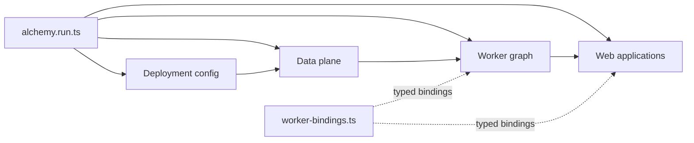

# Application Platform Starter

A TypeScript monorepo for Cloudflare applications that have outgrown one Worker and one web app.

Use this starter when one Cloudflare project needs several web applications, service Workers, background processors, queues, databases, buckets, Durable Objects, or other resources that depend on one another. [Alchemy](https://alchemy.run/) is the organizing layer. It turns that topology into one typed program for local development, tests, and production.

The repository starts with one web application, two Workers, and a representative data plane. That resource count is an example, not a constraint. Add more runtimes and services by extending the same graph.

## What this starter solves

A small Cloudflare project can keep its deployment details in one configuration file. That approach becomes hard to reason about when the system grows across many runtimes and resources.

This starter keeps the complete platform in one place:

- Alchemy creates resources in dependency order and passes their outputs directly to the runtimes that need them.
- Worker bindings are declared in [`infra/src/worker-bindings.ts`](infra/src/worker-bindings.ts). Native Workers infer their environment types; the Effect processor receives typed Alchemy clients.
- Runtime-to-runtime traffic uses service bindings instead of exposing internal Workers at public URLs.
- Runtimes do not maintain separate Wrangler configurations. The Alchemy program owns their resources, bindings, and deployment settings.
- Stages isolate local development, production, and deployed tests with Alchemy-generated resource names.
- `alchemy dev` runs the Worker graph in workerd with local implementations of D1, R2, Queues, and Durable Objects.
- A shared contracts package defines data and failures that cross runtime boundaries.
- Turborepo coordinates builds, type checks, and tests across every workspace.

The result is a repository where adding another Worker or data service extends the existing graph. It does not create another disconnected deployment setup.

## The infrastructure graph

[`infra/alchemy.run.ts`](infra/alchemy.run.ts) is the entry point for the platform. It composes small infrastructure modules and passes provisioned resources forward as typed values:



The current graph has three layers:

1. [`infra/src/data-plane.ts`](infra/src/data-plane.ts) creates shared state and messaging resources.
2. [`infra/src/workers.ts`](infra/src/workers.ts) creates internal Workers and connects them to the data plane and to one another.
3. [`infra/src/web-application.ts`](infra/src/web-application.ts) creates the public application and binds it to the internal Worker graph.

[`infra/src/deployment-config.ts`](infra/src/deployment-config.ts) selects stage behavior. Alchemy generates physical resource names from the stack, stage, and resource identity.

This order is intentional. A downstream runtime receives the actual resource object created upstream, so its binding, identifier, and TypeScript type stay connected. When the platform grows, add another focused infrastructure module and compose it from the same entry point.

## What is included

- A TanStack Start web application with React, TanStack Router, TanStack Query, Tailwind CSS, and shadcn components
- Separate API and background processor Worker workspaces
- D1, R2, Queue, dead-letter queue, Durable Object, Worker, and Website resources managed by Alchemy
- Typed Worker service bindings and Effect RPC transport
- Shared Effect schemas and tagged failures in `@repo/contracts`
- Local Worker integration tests with Cloudflare's Vitest pool
- A live infrastructure test that deploys and destroys an isolated Cloudflare stage
- pnpm workspaces, Turborepo, TypeScript, Oxlint, Oxfmt, and repository-specific lint rules
- A version-matched Effect source subtree for checking APIs and project idioms

## Create a project from the starter

You need Node.js 24, Corepack, and a Cloudflare account.

Create a new project without this repository's Git history:

```sh
npx degit AdiRishi/application-platform-starter acme-platform
cd acme-platform
corepack enable
pnpm install
```

Rename the starter before you change its structure:

```sh
pnpm rename acme-platform
pnpm install
```

The rename command accepts a kebab-case name of up to 32 characters. It updates the root package name, the Alchemy stack name, and the README heading. Run it once on a fresh copy. The second install refreshes `pnpm-lock.yaml` with the new package name.

Start the complete platform:

```sh
pnpm dev
```

Alchemy prints the local web URL when the stack is ready. Upload `fixtures/transactions.csv` to check the complete flow.

## Work locally

Run development from the repository root:

```sh
pnpm dev
```

Internal packages export TypeScript source directly, so edits do not need a separate compilation step. The root command starts the Alchemy `dev` stage, provisions local resources, launches each Worker in workerd, and starts the web development server with its bindings attached.

Do not start the web workspace with Vite alone. The application expects bindings supplied by the Alchemy stack.

On the first run, Alchemy may ask you to authenticate with Cloudflare so it can initialize its state store. Resources with local implementations still run on your machine. For non-interactive authentication, use the variables documented in [`infra/.env.example`](infra/.env.example).

## Grow the platform

The existing web application and Workers are examples of how to connect deployables. Add or replace them to match your system.

To add a runtime or resource:

1. Add the application under `apps/*` or the Worker under `workers/*`.
2. Define shared schemas, failures, and RPCs in [`packages/contracts`](packages/contracts).
3. Create the required Cloudflare resources in a focused module under [`infra/src`](infra/src).
4. Add each runtime binding to [`infra/src/worker-bindings.ts`](infra/src/worker-bindings.ts).
5. Compose the new module into [`infra/alchemy.run.ts`](infra/alchemy.run.ts) and pass real resource outputs to its consumers.
6. Cover local behavior through the runtime's public interface. Add a live infrastructure test when the behavior depends on deployed Cloudflare resources.

Keep deployment topology in `infra/`. Individual runtimes consume bindings; they do not duplicate the platform configuration.

## Project map

| Path                                       | Responsibility                                                              |
| ------------------------------------------ | --------------------------------------------------------------------------- |
| [`apps/*`](apps)                           | Public web applications and their server runtimes                           |
| [`workers/*`](workers)                     | APIs, processors, queue consumers, and other Worker services                |
| [`packages/contracts`](packages/contracts) | Schemas, errors, RPC definitions, and transport shared across runtimes      |
| [`infra`](infra)                           | The Alchemy program, resource graph, bindings, stages, and deployment tests |
| [`migrations`](migrations)                 | D1 schema migrations                                                        |
| [`tooling`](tooling)                       | Shared TypeScript configuration and repository-specific lint rules          |
| [`scripts`](scripts)                       | Project rename and reference repository tooling                             |
| [`.repos/effect`](.repos/effect)           | Read-only Effect source matched to the workspace version                    |
| [`docs/adr`](docs/adr)                     | Decisions that govern repository structure and test layout                  |

The pnpm workspace discovers new projects through `apps/*`, `workers/*`, and `packages/*`. Most new runtimes need no root package manifest changes.

## Application code organisation

The web app groups code by feature under `apps/web/src/features/`. The disposable CSV example lives in `features/artifacts/`:

- `page.tsx` composes the screen and owns selection and mutation state. The other components in this directory render the upload, list, status, and detail views.
- `queries.ts` owns query keys, fetching, staleness, and polling. Route loaders and components use the same query options.
- `functions.ts` validates server-function inputs and calls the internal API. `upload.ts` owns the browser's multipart HTTP upload.

`worker.ts` is the web Worker entrypoint. It delegates HTTP requests to TanStack Start and owns any additional Worker handlers.

`routes/` owns URLs, loaders, and HTTP handlers. Routes import feature pages directly. Keep reusable UI in `components/ui/`, application-wide client setup in `lib/`, and server transport and error handling in `server/`. Import feature modules directly rather than adding barrel exports. Add hooks or presentation modules when a feature has logic worth separating; a simple component does not need a matching hook.

Workers follow the same ownership rule: `artifacts/` owns domain services, repositories, and handlers; `platform/` owns runtime adapters. Shared wire schemas and the web-to-API RPC definitions live in `packages/contracts` under the `artifacts` and `artifacts/api` exports. The API calls the processor through Alchemy's typed native Worker RPC. The contracts package's `client` and `server` exports contain reusable transport. Deployment wiring lives in `infra/`. Tests mirror their owning source paths under `tests/`.

The processor's Alchemy entrypoint is `infra/src/processor.ts`. Its init phase binds an R2 read client, `SQL.D1Layer`, and the profile-session Durable Object, then registers both queue consumers. Application services stay under `workers/processor/src/`. Alchemy owns event scopes, RPC transport, and queue acknowledgement and retry. Both consumers process one message per batch; invalid jobs are logged and acknowledged, and processing failures trigger retry.

The pinned Alchemy package has a type-only patch allowing a resource output as `consumeQueueMessages`'s `deadLetterQueue`. The consumer already accepts that value at runtime. Review `patches/alchemy@2.0.0-beta.76.patch` when upgrading Alchemy.

Replace the sample by replacing its feature directory and routes, then its Worker domain modules and contracts. The shared UI, query client, server transport, and infrastructure composition remain useful for the next feature.

## Stages

Stage names select explicit policies in `infra/src/deployment-config.ts`:

| Stage          | Command                                    | Purpose                                              |
| -------------- | ------------------------------------------ | ---------------------------------------------------- |
| `dev`          | `pnpm dev`                                 | Local Workers and local data service implementations |
| `prod`         | `pnpm plan`, then `pnpm prod`              | Production resources in Cloudflare                   |
| `staging`      | `pnpm --filter @repo/infra deploy:staging` | Persistent remote staging resources                  |
| `test-<8 hex>` | `pnpm test`, `pnpm test:infra-live`        | Isolated local or live resources for one suite       |

Alchemy generates physical names from the stack, stage, logical ID, and resource instance. Keep logical IDs stable when moving declarations between files.

## Test the platform

Run the local validation suite before you commit:

```sh
pnpm check
pnpm typecheck
pnpm test
```

`pnpm test` runs infrastructure integration tests with `alchemy/Test/Vitest` and `dev: true`. Alchemy starts the local stack, applies migrations, wires bindings, and destroys it after each suite. Tests cover HTTP/RPC contracts, real queue processing and dead letters, Durable Object progress, and the browser upload/download flow. Recovery fixtures use Alchemy Actions to seed D1 and R2. These tests do not create cloud resources.

Pure Effect tests and React Testing Library tests stay in their owning workspaces. Run `pnpm --filter @repo/infra test` for the local platform tests or `pnpm --filter @repo/web test` for the UI tests. Vitest runs teardown hooks in registration order so stack destruction precedes Alchemy's runtime cleanup.

Install Chromium once with `pnpm --filter @repo/infra exec playwright install chromium`. Use the live suite when you change infrastructure or behavior that depends on a real deployment:

```sh
pnpm test:infra-live
```

The live-test configuration loads `infra/.env` when present, without replacing exported environment variables.

The public application suite also runs against Cloudflare with a unique `test-*` stage. A browser uploads a CSV, waits for its profile, and downloads the source through the public application. The harness destroys the stage after the suite.

Tests live in a separate `tests/` directory that mirrors each workspace's `src/` tree. Read [the test layout decision](docs/adr/0001-mirror-tests-in-a-tests-directory.mdx) before changing the test setup.

## Deploy to Cloudflare

Review the production plan:

```sh
pnpm plan
```

Alchemy prompts for Cloudflare authentication when no saved profile is available. In CI, provide `CLOUDFLARE_ACCOUNT_ID` and `CLOUDFLARE_API_TOKEN`.

Deploy the `prod` stage after you review the plan:

```sh
pnpm prod
```

The deployment command applies the complete resource graph and prints the public application URL returned by the stack.

Run `pnpm dev:destroy` or `pnpm prod:destroy` to destroy the corresponding stage. Both commands prompt for confirmation.

## Commands

Root scripts are the public interface for routine work:

| Command                | Purpose                                                                   |
| ---------------------- | ------------------------------------------------------------------------- |
| `pnpm dev`             | Run the full local platform with hot reload                               |
| `pnpm dev:destroy`     | Destroy the development stage                                             |
| `pnpm build`           | Build every workspace                                                     |
| `pnpm check`           | Run Oxlint and check formatting                                           |
| `pnpm fix`             | Fix lint and formatting errors that can be fixed automatically            |
| `pnpm typecheck`       | Type-check production and test projects across the monorepo               |
| `pnpm test`            | Run local tests across all workspaces                                     |
| `pnpm test:infra-live` | Deploy, test, and destroy an isolated live stage                          |
| `pnpm plan`            | Preview production infrastructure changes                                 |
| `pnpm prod`            | Deploy the production stage                                               |
| `pnpm prod:destroy`    | Destroy the production stage                                              |
| `pnpm rename <name>`   | Replace the starter's project and infrastructure identity                 |
| `pnpm sync:repos`      | Sync source references to the dependency versions pinned by the workspace |

## About the reference application

The included application is a disposable proof that the platform works across a public web runtime, private Workers, shared state, asynchronous processing, failure recovery, and deployment. Keep it while you learn the repository, then replace it with your own runtimes and resources.

The sample is anonymous and shared: every visitor can list and download uploaded files. It accepts CSV files up to 256 KB, and does not implement user ownership or artifact cleanup. Replace it before using the starter for private data.

D1 owns artifact status and results. An artifact row with no dispatch timestamp is durable pending work. The API attempts delivery after responding; a scheduled dispatcher retries pending rows every minute. Duplicate delivery is safe, and completed results survive late dead letters. The Durable Object holds only advisory progress.

To add a persistent environment, extend the stage policy map and select its public domain there. Internal Workers stay private in every stage, including live tests.

Structured reads use shared Query options and validated server functions. The web calls the API with `withRpcClient` over a service binding and a 10-second deadline. The API calls the processor through Alchemy native RPC with a 5-second deadline. Query cancellation passes a signal to the server function, and the server runs its Effect with the incoming request signal.

`AppRequestError` carries a safe code and message across the server-function boundary. Features map their domain errors; shared request execution handles transport failures and preserves mapped application errors. Diagnostics remain in server logs. Queries retry `unavailable` errors at most twice. Validation, not-found, and internal errors do not retry, and mutations never retry automatically. File upload and download retain their streaming HTTP routes.
