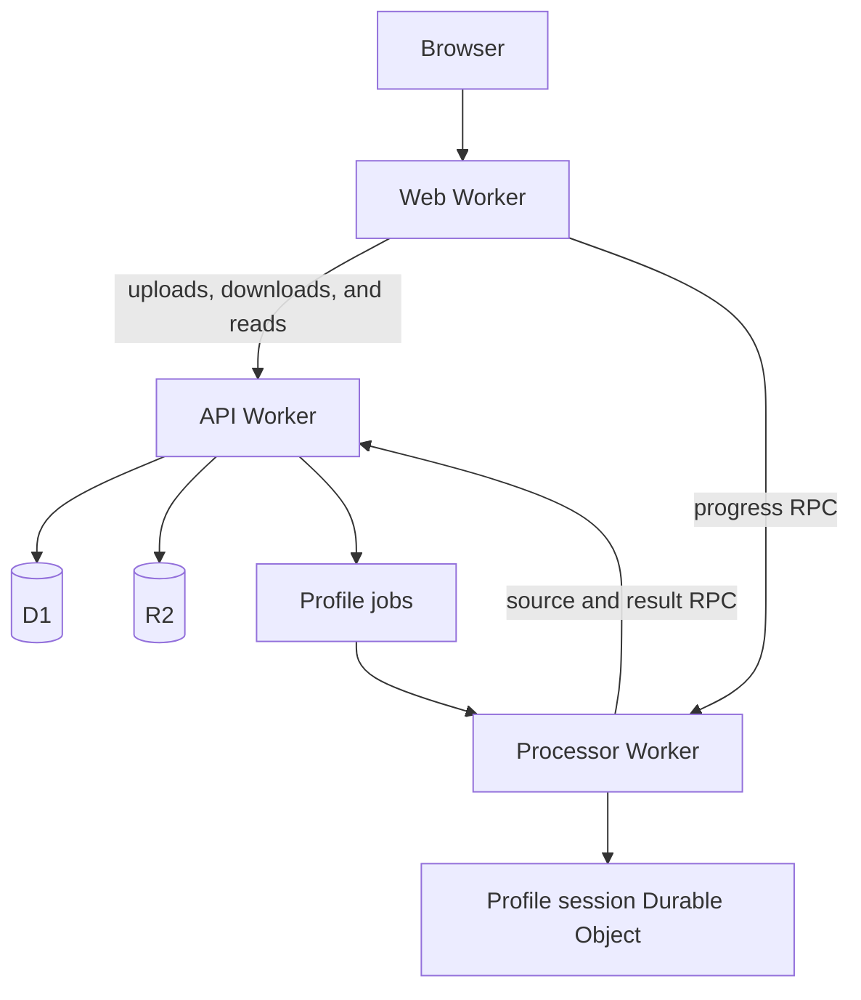

## One infrastructure graph

`infra/alchemy.run.ts` composes deployment configuration, the Worker graph, and the web application. Resource objects carry their outputs and types into downstream bindings.

The API and processor have no public `workers.dev` URLs. The web Worker reaches both through service bindings. Alchemy supplies local implementations of the same graph during development and integration tests.

| Path                                | Owns                                                 |
| ----------------------------------- | ---------------------------------------------------- |
| `infra/src/data-plane.ts`           | API-owned D1 and R2, plus Queue resources            |
| `infra/src/worker-bindings.ts`      | Runtime bindings and derived environment types       |
| `infra/src/workers.ts`              | Workers, their crons, and their queue consumers      |
| `infra/src/web-application.ts`      | TanStack Start's Alchemy Website resource            |
| `packages/contracts/src/transport/` | Effect RPC over a service binding                    |
| `workers/*/src/artifacts/`          | Services, repositories, and handlers for the example |
| `workers/*/src/platform/`           | Adapters for calls to other runtimes                 |
| `apps/web/src/features/artifacts/`  | UI, query options, and server functions              |
| `apps/web/src/routes/`              | URLs, route loaders, and HTTP handlers               |
| `packages/contracts/`               | Shared schemas and tagged failures                   |
| `workers/api/migrations/`           | D1 schema migrations                                 |

## Worker-to-Worker RPC

Each Worker is a plain module. Its default export handles HTTP, cron, and queue events, and each caller gets its own `WorkerEntrypoint` serving one RPC group from `@repo/contracts`. The API serves `ArtifactsRpcs` to the web app through `ArtifactsApi` and `ProfilingRpcs` to the processor through `ProfilingApi`. The processor serves `ProcessingRpcs` through `ProcessingApi`.

`worker-bindings.ts` binds an entrypoint with `Cloudflare.WorkerEntrypoint(worker, "Name")`. The caller builds a client with `clientOverBinding(group, { binding, service, timeout })`, and the entrypoint answers with `rpcWebHandler(group, handlers)`. Arguments, results, and tagged failures pass through the group's schemas, so a remote failure keeps its tag. A transport failure or missed deadline arrives as `RpcClientError`. Cancellation interrupts the caller's local Effect but does not stop work already executing in the receiving Worker.

To add a method, add it to the caller's group and handle it in the entrypoint's handler layer.

Bindings between plain modules can't form a cycle. The processor calls the API, so the API never calls the processor. The web app composes an artifact's detail from the API's record and the processor's progress.

## The reference application's data flow

An upload writes its source to R2 and creates a queued D1 record. A record without a dispatch timestamp is durable pending work. The API attempts delivery after responding, and a scheduled dispatcher retries pending deliveries every minute.

The API exclusively owns the artifact database and source bucket. The processor consumes queue messages and calls the API to start a profile, fetch source bytes, and report completion or failure. It has no D1 or R2 binding. Sources are capped at 256 KB and travel base64-encoded through RPC.

The API applies every durable status transition. Duplicate delivery is safe; completed results survive late dead letters and lost RPC responses. A failed API call leaves the queue message available for retry. The processor owns the Durable Object that stores advisory progress.

The example is anonymous and shared. Every visitor can list and download files, uploads are limited to 256 KB, and artifacts have no ownership or cleanup policy. Replace it before handling private data.

## Add a runtime

Add web apps under `apps/` and Workers under `workers/`. Keep their application behavior in those workspaces and declare infrastructure under `infra/`.

Define bindings in `worker-bindings.ts`, add the Worker to `workers.ts`, and test through its public HTTP or RPC interface. Alchemy owns bundling, migrations, queue delivery, and local emulation; individual runtimes have no separate Wrangler configuration.

Keep each database's migrations beside its owning app or Worker, such as `workers/api/migrations/`. Other runtimes use the owner's API to access its data. Declare and provision the database under `infra/`, pointing its `migrations` option at that directory.

Keep resource logical IDs stable when moving declarations between files. Alchemy uses those IDs to identify existing resources across deployments.
